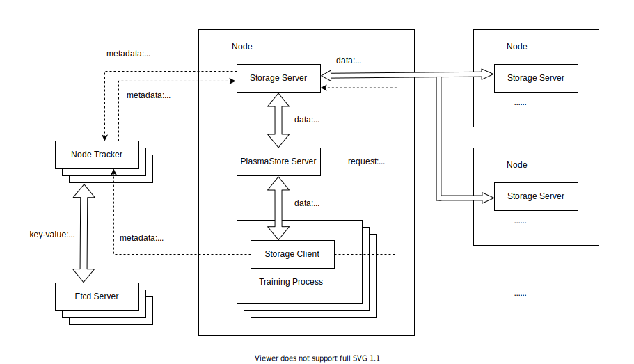
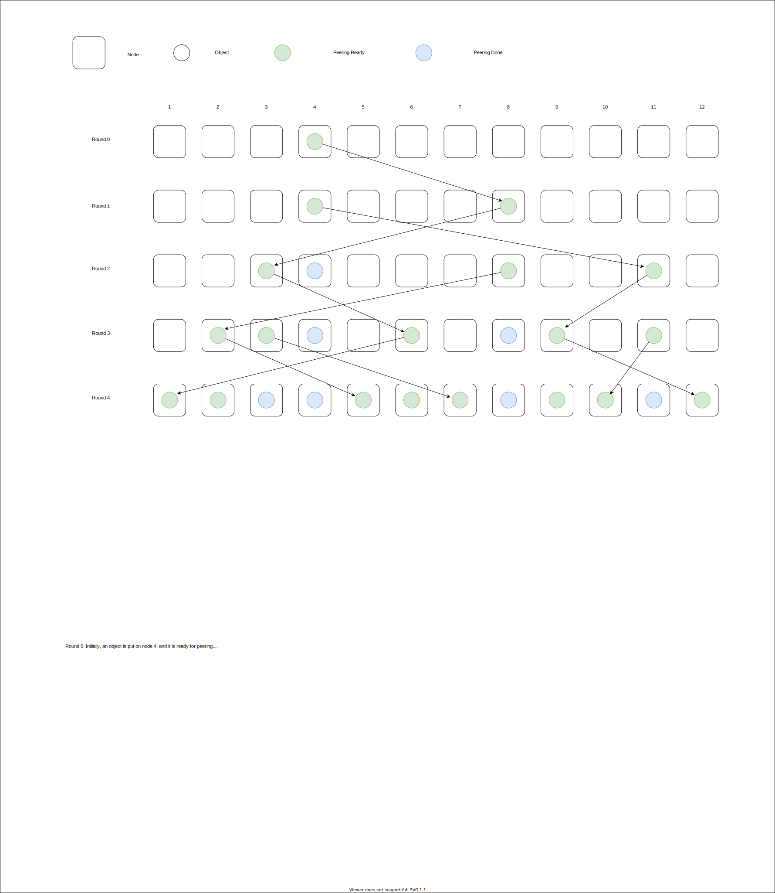

## Introduction
Decision AI Store

<div align="center">
  <a href="https://github.com/opendilab/DI-store"></a>
</div>


## Installation

##### Prerequisites
- Linux or macOS

- Python >= 3.6


```bash
pip install .
```

## Quick Start

##### Start Etcd Server

```bash
di_store etcd_server ./conf/di_store.yaml
```

##### Start Node Tracker
```bash
di_store node_tracker ./conf/di_store.yaml
```

##### Start Storage Server

```bash
di_store storage_server ./conf/di_store.yaml
```

##### Start Storage Client

```python
from di_store import Client
client = Client('./conf/di_store.yaml')
ref = client.put(b'Hello world.')
data = client.get(ref)
print('data:', data)
client.delete(ref)
```

## Object prefetch

start storage server with `group`

```bash
di_store storage_server ./conf/di_store.yaml --group actor
```

specify `prefetch_group` when put object

```python
from di_store import Client
ref = client.put(b'Hello world.', prefetch_group='actor')
```

When an object is put with prefetch_group specified, a background schedule is triggered to spread the object to all nodes corresponding to the group.
The following diagram illustrates the data dissemination.



## Directory Structure
```text
├── di_store: python related codes
│     ├── bin: executable files needed by "etcd_server", "node_tracker" and "storage_server" commands
│     ├── cmd: driver for "di_store" command
│     ├── common: utilities for common
│     ├── driver
│     │     └── etcd_server_driver.py: etcd_server driver
│     ├── node_tracker
│     │     └── node_tracker_client.py: node_tracker client
│     ├── storage
│     │     └── storage_client.py: storage client
│     └── tracing
│           └── tracing.py: utilities for tracing
└── go: golang related codes
      ├── fb: generated by the FlatBuffers compiler
      ├── metadata: etcd client operations
      ├── node_tracker
      │     ├── fetch.go: fetch implementation of node_tracker
      │     ├── main
      │     │     └── node_tracker.go: the main entry point for node_tracker
      │     ├── node_tracker.go
      │     └── node_tracker_client.go
      ├── pb: generated by ProtoBuffers
      ├── plasma_client: golang codes that wraps libplasma
      ├── plasma_server: golang codes that wraps executable plasma-store-server
      ├── protos: .proto and .fbs files
      ├── release: outputs of command "go build", executable files of node_tracker and storage_server
      ├── storage_server
      │     ├── fetch.go: fetch implementation of storage_server
      │     ├── main
      │     │     └── storage_server.go: the main entry point for storage_server
      │     └── storage_server.go
      ├── tracing: utilities for tracing
      └── util
```

## License
DI-store released under the Apache 2.0 license.
